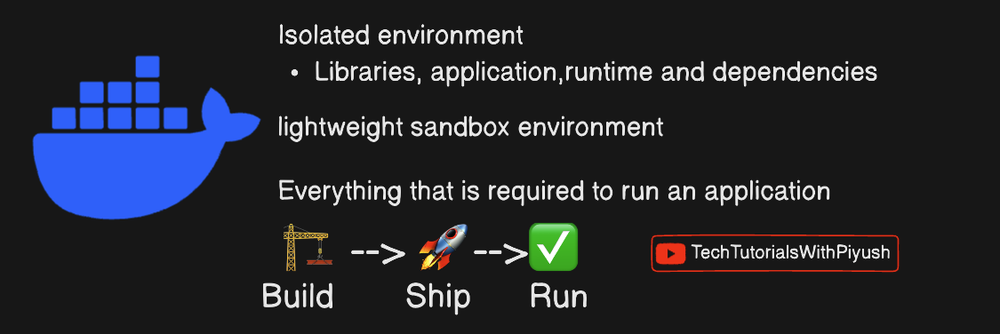
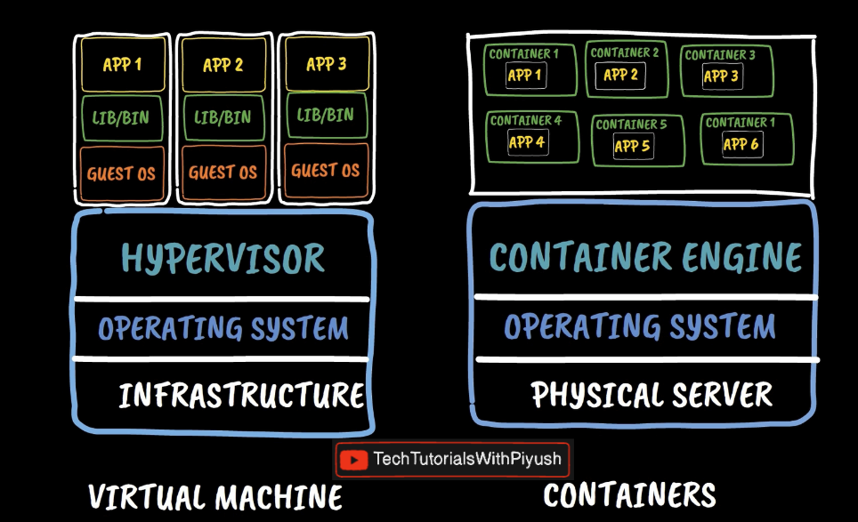
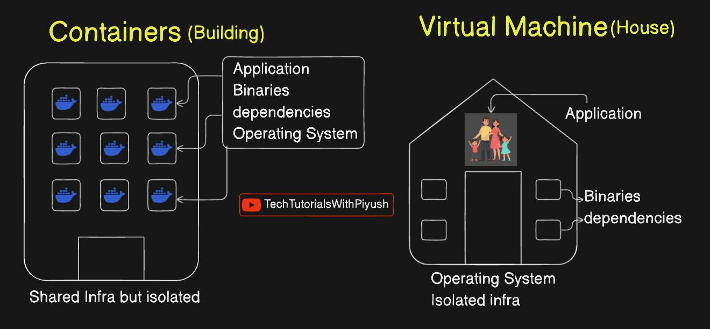
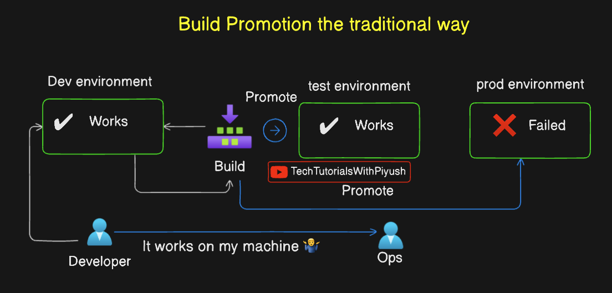
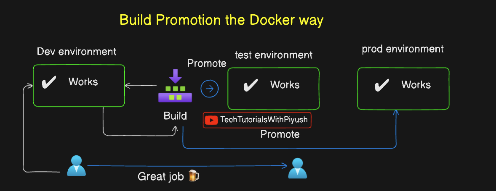
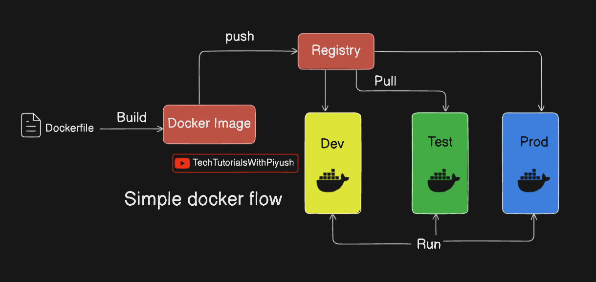
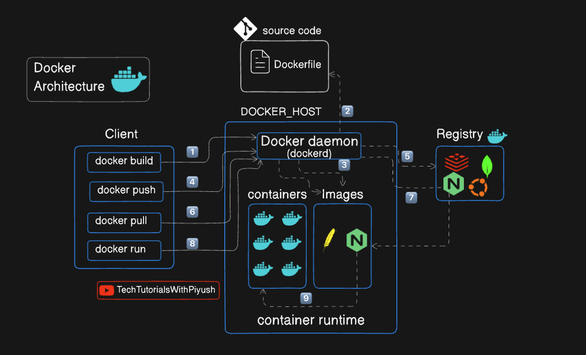

What is Docker

Understanding Containers V/S Virtual Machines

Containers V/S Virtual machines with the help of a Building and House analogy

Challenges with the non-containerized applications

How Docker solves the challenges

A Simple Docker WorkFlow

Docker Architecture
